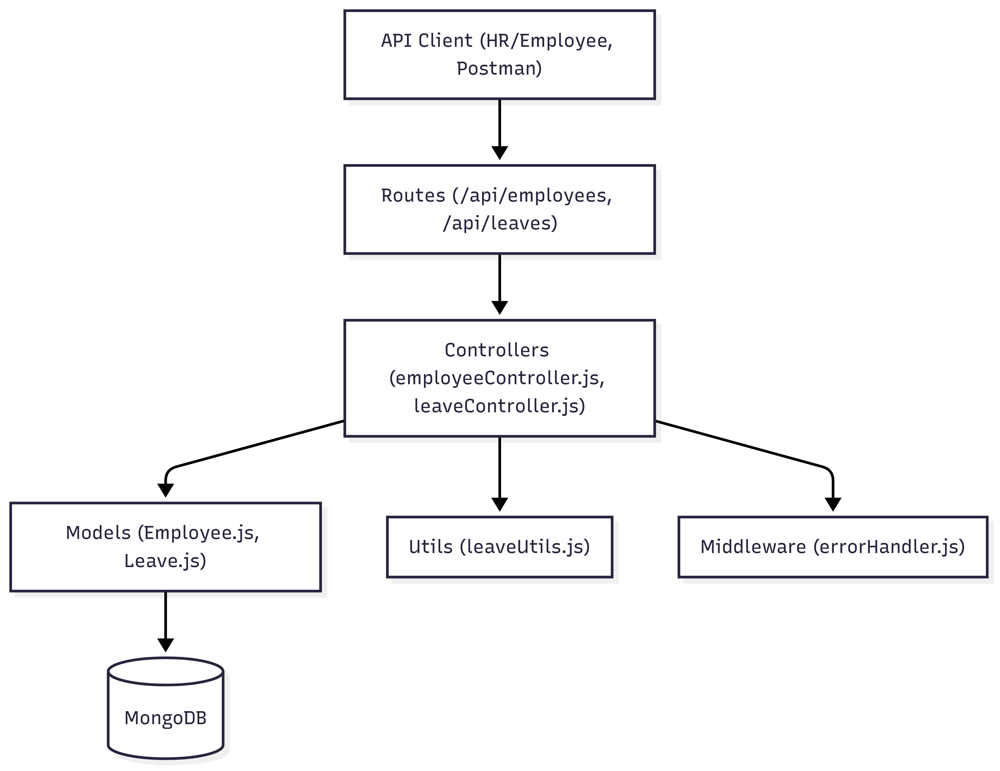
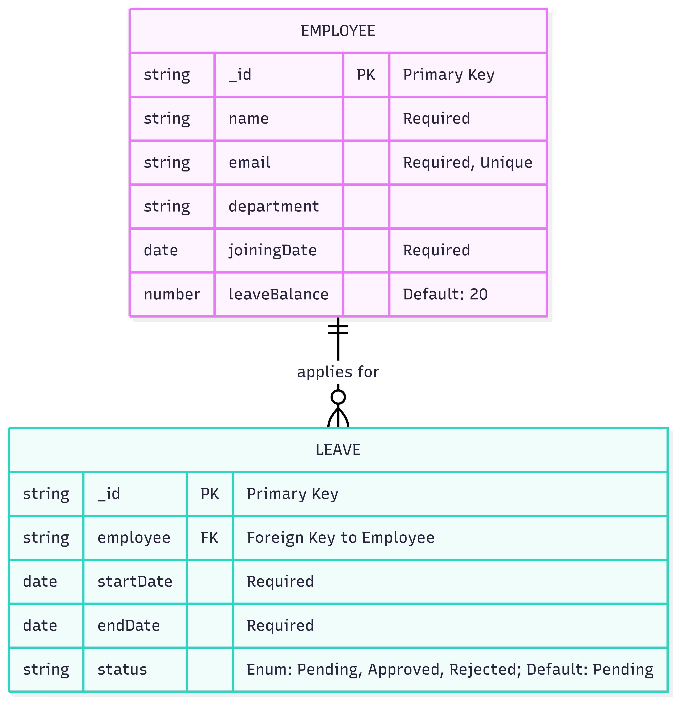
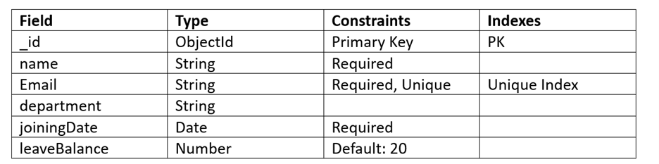
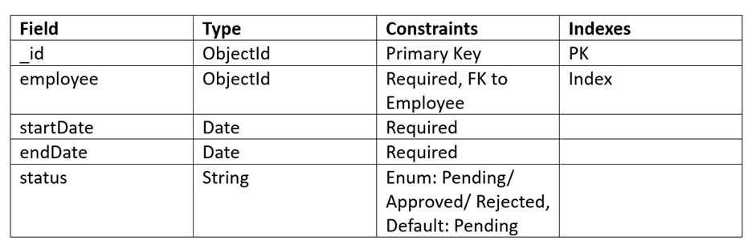

# Mini Leave Management System

A simple MVP backend for managing employee leave requests, balances, and approvals for a startup HR team.

---
Live Backend Url: [Mini Leave Management System](https://mini-leave-management-system.vercel.app/)
## Features

- Add employees (Name, Email, Department, Joining Date)
- Apply for leave (with overlap and balance checks)
- Approve/Reject leave requests
- Track leave balance for each employee
- RESTful API with clear error handling

---

## Architecture Diagram

### High-Level System Design



- **Frontend:** (Not implemented in MVP.)
- **Backend:** Node.js / Express REST API
- **Database:** MongoDB
- **Deployment:** Deployed on Vercel

## Setup Instructions

### Prerequisites

- [Node.js](https://nodejs.org/)
- [Vercel CLI](https://vercel.com/docs/cli)
- [MongoDB](https://www.mongodb.com/)

### Local Development

1. Clone the repo:

   ```bash
   git clone https://github.com/rohit-2002/Mini-Leave-Management-System.git
   cd Mini-Leave-Management-System
   ```
2. **Install dependencies:**
   
   ```bash
    npm install
   ```
3. **Set environment variables in .env:**
   
   ```bash
    PORT=4000
    MONGO_URI=mongodb://localhost:27017/leave-management
    DEFAULT_ANNUAL_LEAVE_DAYS=18
   ```
4. **Start server:**
   
   ```bash
    npm start
   ```
### Part 1 - Data Modelling

### 1. Basic ER Diagram


### 2. Database Tables
#### Employee Table ([/src/models/Employee.js](/src/models/Employee.js))


#### Leave Table ([src/models/Leave.js](/src/models/Leave.js))


#### Leave Transactions
- In this MVP, each leave request is treated as a transaction. If we want a separate audit log, we should add a LeaveTransaction table. Currently, however, all actions are being tracked within the Leave collection.

### 3. Keys, Relationships, Indexes

- **Primary Keys:** `_id` for both Employee and Leave.
- **Foreign Key:** `employee` in Leave references Employee `_id`.
- **Unique Index:** `email` in Employee.
- **Index:** `employee` in Leave for efficient queries by employee.
  
## Part 2 - Low Level System Design

### 1. API contracts (request/response format).
## API Endpoints

### 1. Add an Employee

**POST** `http://localhost:4000/api/employees`

**Request Body:**

```json
{
  "name": "Rohit Baba",
  "email": "rohit123@gmail.com",
  "department": "Engineering",
  "joiningDate": "2025-01-01"
}
```
**Response:**

```
{
    "name": "Rohit Baba",
    "email": "rohit123@gmail.com",
    "department": "Engineering",
    "joiningDate": "2025-01-01T00:00:00.000Z",
    "leaveBalance": 20,
    "_id": "689c42db848ca97cd0d2a87f",
    "__v": 0
}
```
### 2.  Apply for Leave

**POST** `http://localhost:4000/api/leaves/apply`

```json
{
  "employeeId": "689c42db848ca97cd0d2a87f",
  "startDate": "2025-02-10",
  "endDate": "2025-02-12"
}
```
**Responce:**

```json
{
    "employee": "689c42db848ca97cd0d2a87f",
    "startDate": "2025-02-10T00:00:00.000Z",
    "endDate": "2025-02-12T00:00:00.000Z",
    "status": "Pending",
    "_id": "689c4342848ca97cd0d2a883",
    "__v": 0
}
```
### 3. Approve Leave

**PUT** `http://localhost:4000/api/leaves/689c4342848ca97cd0d2a883/approve`

**Responce:**

```json
{
    "_id": "689c4342848ca97cd0d2a883",
    "employee": {
        "_id": "689c42db848ca97cd0d2a87f",
        "name": "Rohit Baba",
        "email": "rohit123@gmail.com",
        "department": "Engineering",
        "joiningDate": "2025-01-01T00:00:00.000Z",
        "leaveBalance": 17,
        "__v": 0
    },
    "startDate": "2025-02-10T00:00:00.000Z",
    "endDate": "2025-02-12T00:00:00.000Z",
    "status": "Approved",
    "__v": 0
}
```

### 4. Fetch Leave Balance

**GET** ` http://localhost:4000/api/employees/689c42db848ca97cd0d2a87f/leave-balance`

**Responce:**

```json
{
    "leaveBalance": 17
}
```
### 5. Fetch Employees details
**GET** `http://localhost:4000/api/employees`

**Responce:**
```json
[
    {
        "_id": "689c42db848ca97cd0d2a87f",
        "name": "Rohit Baba",
        "email": "rohit123@gmail.com",
        "department": "Engineering",
        "joiningDate": "2025-01-01T00:00:00.000Z",
        "leaveBalance": 17,
        "__v": 0
    }
]

```
### 2. Class/Module Design
#### **1. EmployeeService**
- Handles employee CRUD, leave balance logic.
#### **2. LeaveService**
- Handles leave application, approval, rejection, overlap checks, and leave calculations.
#### **3. Utility Modules**
- `leaveUtils.js`: For calculating leave days and checking overlaps.
#### **4. Controllers**
- [employeeController.js](/src/controllers/employeeController.js)
- [leaveController.js](/src/controllers/leaveController.js)
#### **5. Models**
- [Employee.js](/src/models/Employee.js)
- [Leave.js](/src/models/Leave.js)
  
### 3. Pseudocode for Leave Approval Logic
```bash
function approveLeave(leaveId):
    leave = find Leave by leaveId (populate employee)
    if leave not found:
        return error "Leave request not found"
    if leave.status == "Approved":
        return error "Leave already approved"
    days = calculateDays(leave.startDate, leave.endDate)
    if leave.employee.leaveBalance < days:
        return error "Insufficient leave balance"
    leave.status = "Approved"
    leave.employee.leaveBalance -= days
    save leave.employee
    save leave
    return leave
```
### Edge Cases Handled
- Leave applied before joining date  
- Leave requested exceeds available balance  
- Overlapping leave requests  
- Employee not found  
- Invalid date ranges (end date before start date)  
- Duplicate employee email  
- Negative or zero leave days

### Assumptions
- Each employee starts with 18 leave days  
- Weekends/holidays not excluded from leave count  
- No authentication or authorization included  
- Leaves can only be applied for future dates  

### Potential Improvements
- Add auth & roles  
- Frontend dashboard  
- Handle weekends/holidays  
- Email notifications  
- Audit logs  
- Pagination/filtering  
- MongoDB transactions  
